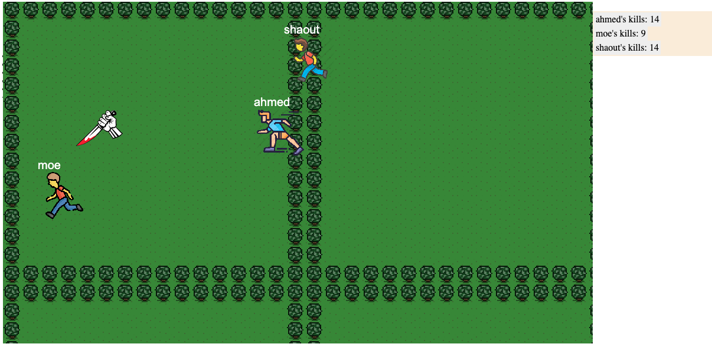

# Kill and Win
this is a multi-player online game written in JavaScript for client side and TypeScript for server side. Game code follows the Object Oriented Programming paradigm. To see this game live, go to [Kill and Win](https://kill-and-win.herokuapp.com/)

## Image of the game interface

## Prerequisites
-   you need to install Git in your local machine and clone this repo
-   you need node 10.x installed along with npm

## Run game
- cd to this project directory
- run `npm install` in command line
- run `npm start startDev` and game will start a dev build
- go to [localhost:8080](http://localhost:8080)
- then you will be prompted to enter your name and start playing
- **Note**: Game starts when there is two or more players online

